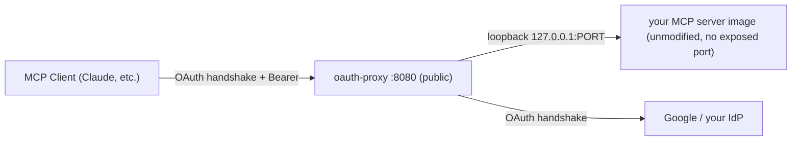

# mcp-oauth-proxy

A stateless, spec-compliant **MCP OAuth 2.1** front door for any unmodified
MCP server image, designed to run as a Cloud Run sidecar that scales to
zero, with zero external dependencies (no database) for its statelessness.
It turns "an MCP server with no auth story for third-party clients" into
one that Claude.ai, Claude Code, or any other MCP client can connect to
with a normal OAuth login.

## Why this exists

Most third-party MCP server images (Grafana's, and plenty of others) speak
plain HTTP with no authorization layer at all — fine on localhost, not
fine on the public internet. The MCP spec requires the server to behave as
an OAuth 2.1 resource server (RFC 9728 protected-resource metadata, `401`
+ `WWW-Authenticate` challenges, audience-bound tokens) and expects an
authorization server behind it that supports PKCE and — historically —
Dynamic Client Registration. Cloud providers rarely offer that as a
turnkey product in front of an arbitrary container (Cloudflare Access
Managed OAuth is the closest thing that exists anywhere, and it's
Cloudflare-only).

This proxy is that missing piece:

- **Downstream** (to the MCP client): it *is* the OAuth 2.1 authorization
  server and resource-server guard. It serves discovery metadata, handles
  `/register`, `/authorize`, `/token`, and gates the MCP endpoint.
- **Upstream** (to your real identity provider — Google by default): it's
  an ordinary pre-registered OAuth client.

The MCP client believes it's talking to a fully spec-compliant,
dynamically-registerable AS. Underneath, real identity comes from
whatever IdP you already have.

## Architecture

Deployed as a Cloud Run **multi-container service**: this proxy is the
only container with a public port; your MCP server image runs unmodified,
with no exposed port, reachable only over `127.0.0.1` from inside the same
instance.



Why a sidecar instead of forking the image or running two Cloud Run
services: the backend image stays byte-for-byte untouched, there's one
cold start per request instead of two, and the loopback hop between
containers is free. The proxy never parses MCP messages — once a bearer
token validates, it streams raw bytes both directions (SSE-safe, no read
timeout, and it never needs updating when the MCP protocol revs).

## Why it's safe to scale to zero (zero external dependencies)

There is no in-memory session or client store anywhere in this proxy, and
crucially **no database either** — that's the whole design constraint,
since Cloud Run can scale to zero and fan requests across many instances.
Every piece of OAuth flow state is a **signed JWT**, using one shared
`SIGNING_KEY`:

| What | How it stays stateless |
|---|---|
| `client_id` from `/register` | Signed JWT containing the registered `redirect_uris`. Forging one requires the signing key. |
| `state` sent to the upstream IdP | Signed JWT carrying the entire in-flight request — including the proxy's own upstream PKCE verifier — so ANY instance can resume the flow when the IdP redirects back. |
| Authorization code | Signed JWT, ~120s TTL, bound to the client's PKCE challenge. |
| Access / refresh tokens | Signed JWTs, audience-bound to your MCP server's resource URI. |

Any cold instance can mint or validate any of these using only
`SIGNING_KEY` from Secret Manager — no shared memory, no Postgres, no
Redis. Set `--min-instances=0`.

Trade-off: JWTs can't be revoked before they expire. Keep
`ACCESS_TOKEN_TTL` short (default 1h); removing someone from
`ALLOWED_EMAILS`/`ALLOWED_DOMAINS` blocks new logins/refreshes immediately
but not an already-issued access token.

## Using this with a different MCP server

The proxy is server-agnostic — everything server-specific is env vars and
the *other* container in the Cloud Run deploy command. To point it at a
new MCP server image:

1. Confirm the image can run in **streamable-http** (or SSE) mode bound to
   `127.0.0.1` on some port, with no auth of its own required (the proxy
   is the auth boundary — trust the `X-Auth-Email` / `X-Auth-Subject` /
   `X-Auth-Scope` headers it injects if the backend wants per-user logic).
2. Set `UPSTREAM_URL=http://127.0.0.1:<that port>` and
   `RESOURCE=https://<your-run.app-url>/mcp` (path included — this must
   match exactly what the client connects to).
3. Deploy both containers as one Cloud Run service, proxy container public
   on `--port=8080`, backend container with **no `--port` flag at all**.

See [`examples/grafana-mcp/`](examples/grafana-mcp) for a full worked
example deploying `grafana/mcp-grafana:latest` this way, using Cloud Run's
default `*.run.app` URL (no custom domain needed).

## Environment variables (proxy container)

| Var | Required | Meaning |
|---|---|---|
| `PUBLIC_URL` | yes | External HTTPS URL of the proxy, no trailing slash (e.g. the Cloud Run `*.run.app` URL) |
| `UPSTREAM_URL` | yes | Loopback URL of the backend MCP container, e.g. `http://127.0.0.1:8000` |
| `RESOURCE` | no | Canonical MCP resource URI; defaults to `PUBLIC_URL/mcp` |
| `SIGNING_KEY` | yes | Long random secret (`openssl rand -base64 48`); rotating it invalidates every issued token/client at once |
| `GOOGLE_CLIENT_ID` / `GOOGLE_CLIENT_SECRET` | yes | Pre-registered OAuth client for the upstream IdP leg |
| `ALLOWED_EMAILS` | one of these two required | Comma-separated exact emails |
| `ALLOWED_DOMAINS` | required | Comma-separated Workspace domains |
| `ACCESS_TOKEN_TTL` | no | Seconds, default `3600` |
| `REFRESH_TOKEN_TTL` | no | Seconds, default `1209600` (14d) |

The proxy **refuses to start** if neither `ALLOWED_EMAILS` nor
`ALLOWED_DOMAINS` is set — fail closed, not accept-all.

## One-time upstream IdP setup (Google, default)

Google Cloud Console → APIs & Services → Credentials → OAuth client ID
(Web application):

- Authorized redirect URI: `https://<PUBLIC_URL>/oauth2/callback`. If
  you're deploying to Cloud Run's default `run.app` URL, you won't know
  this until after the first deploy — see the worked example's two-phase
  `deploy.sh`, which prints the exact redirect URI to register.
- Consent screen: **Internal** if everyone is on one Workspace domain —
  sidesteps Google's verification review entirely.

Swapping in a different IdP means changing the three Google-specific
constants at the top of `app.py` (`GOOGLE_AUTH_ENDPOINT`,
`GOOGLE_TOKEN_ENDPOINT`, `GOOGLE_USERINFO_ENDPOINT`) and the client
id/secret env vars — the rest of the flow (state signing, PKCE, allowlist)
is IdP-agnostic.

## Secrets

```bash
openssl rand -base64 48 | gcloud secrets create mcp-signing-key --data-file=-
echo -n "$GOOGLE_CLIENT_ID"     | gcloud secrets create google-client-id --data-file=-
echo -n "$GOOGLE_CLIENT_SECRET" | gcloud secrets create google-client-secret --data-file=-
```

## Build & push the proxy image

The proxy is fully generic — no MCP-specific config is baked into the
image (see the [`Dockerfile`](Dockerfile): just `app.py` +
`requirements.txt`) — so one build serves every MCP server's deployment.
[`.github/workflows/build.yml`](.github/workflows/build.yml) builds and
publishes it automatically on every push to `main` that touches the
proxy's source, to **GitHub Container Registry**:

```
ghcr.io/<owner>/mcp-oauth-proxy:latest
ghcr.io/<owner>/mcp-oauth-proxy:<commit-sha>
```

No Google Cloud setup required for this step — auth is just the repo's
built-in `GITHUB_TOKEN` against `ghcr.io`. If something outside GitHub
Actions needs to pull the image (e.g. Cloud Run deploying it), either make
the package public (repo → Packages → this package → Package settings →
Change visibility) or generate a PAT with `read:packages` and hand that to
whatever's pulling it — GHCR doesn't have a Workload-Identity-style
keyless option like Artifact Registry does.

To build locally instead:

```bash
docker build -t oauth-proxy:local .
docker run --rm -p 8080:8080 --env-file .env oauth-proxy:local
```

## Deploying a new MCP server to Cloud Run

This repo deploys **one MCP server per branch**, never from `main` —
`main` only carries the proxy source and this shared, reusable deploy
workflow; each MCP server gets its own `deploy/<name>` branch with its own
GitHub Environment, so unrelated MCP deployments never trigger or
misconfigure each other.

[`.github/workflows/deploy-service.yml`](.github/workflows/deploy-service.yml)
does the actual `gcloud run deploy` — WIF auth, the two-phase bootstrap for
a brand-new service's `*.run.app` URL, all of it — as a **reusable
workflow** (`on: workflow_call`), so every deploy branch calls it instead
of copy-pasting the same ~130 lines of YAML. A new branch's own workflow
is just a thin caller:

```yaml
# .github/workflows/deploy.yml on deploy/<name>
name: deploy <name>

on:
  push:
    branches: [deploy/<name>]
  workflow_dispatch:

jobs:
  # Only needed if this MCP server has its own credentials to inject
  # (e.g. a service-account token) -- skip this job if it doesn't.
  prepare:
    runs-on: ubuntu-latest
    environment: <name>
    outputs:
      backend_env_vars: ${{ steps.compose.outputs.value }}
    steps:
      - id: compose
        env:
          SOME_TOKEN: ${{ secrets.SOME_TOKEN }}
        run: echo "value=SOME_TOKEN=${SOME_TOKEN}" >> "$GITHUB_OUTPUT"

  deploy:
    needs: prepare
    # `with:` below is evaluated in *this* job's context, before the call
    # happens -- without `environment:` set here too, `vars.*` only sees
    # repo/org-level variables, not the ones configured under this
    # Environment, and every input below silently resolves empty.
    environment: <name>
    permissions:
      contents: read
      id-token: write # deploy-service.yml needs this granted here to use it itself
    uses: <owner>/mcp-oauth-proxy/.github/workflows/deploy-service.yml@main
    with:
      environment: <name>
      service: ${{ vars.SERVICE }}
      project_id: ${{ vars.PROJECT_ID }}
      region: ${{ vars.REGION }}
      workload_identity_provider: ${{ vars.WORKLOAD_IDENTITY_PROVIDER }}
      deployer_service_account: ${{ vars.DEPLOYER_SERVICE_ACCOUNT }}
      allowed_domains: ${{ vars.ALLOWED_DOMAINS }}
      backend_image: <backend-image>
      backend_command: <comma,separated,argv>
      backend_port: "<port>"
      backend_env_vars: ${{ needs.prepare.outputs.backend_env_vars }}
    secrets: inherit
```

The `prepare` → `deploy` split exists only because a reusable workflow's
`with:` can't reference the `secrets` context directly (GitHub blocks
smuggling raw secrets into plain inputs) — so a backend credential has to
be composed into a string by an ordinary job first, then handed to the
reusable workflow as that job's *output*. `secrets: inherit` separately
passes through `SIGNING_KEY`/`GOOGLE_CLIENT_ID`/`GOOGLE_CLIENT_SECRET` (the
proxy's own, fixed-name secrets) automatically.

### Per-MCP GitHub Environment

Create a GitHub Environment named after the branch (`<name>`) with:

**Variables:** `SERVICE`, `PROJECT_ID`, `REGION`, `WORKLOAD_IDENTITY_PROVIDER`,
`DEPLOYER_SERVICE_ACCOUNT`, `ALLOWED_DOMAINS`, plus any of this MCP
server's own non-secret config.

**Secrets:** `SIGNING_KEY` (`openssl rand -base64 48`), `GOOGLE_CLIENT_ID`,
`GOOGLE_CLIENT_SECRET`, plus any of this MCP server's own credentials.

Add **required reviewers** on the Environment for anything you'd consider
production — that's the approval gate, no extra tooling needed.

### One-time GCP setup (per project, not per MCP)

Only Workload Identity Federation and a deployer service account are
needed — **no Artifact Registry repo**, since the image is pulled from
`ghcr.io`, not GAR:

```bash
gcloud iam workload-identity-pools create github-pool \
  --project="$PROJECT_ID" --location=global --display-name="GitHub Actions"

gcloud iam workload-identity-pools providers create-oidc github-provider \
  --project="$PROJECT_ID" --location=global --workload-identity-pool=github-pool \
  --display-name="GitHub" --issuer-uri="https://token.actions.githubusercontent.com" \
  --attribute-mapping="google.subject=assertion.sub,attribute.repository=assertion.repository" \
  --attribute-condition="assertion.repository=='<owner>/mcp-oauth-proxy'"

gcloud iam service-accounts create gh-deployer --project="$PROJECT_ID"

gcloud iam service-accounts add-iam-policy-binding \
  "gh-deployer@${PROJECT_ID}.iam.gserviceaccount.com" \
  --project="$PROJECT_ID" --role=roles/iam.workloadIdentityUser \
  --member="principalSet://iam.googleapis.com/projects/<PROJECT_NUMBER>/locations/global/workloadIdentityPools/github-pool/attribute.repository/<owner>/mcp-oauth-proxy"

gcloud projects add-iam-policy-binding "$PROJECT_ID" \
  --member="serviceAccount:gh-deployer@${PROJECT_ID}.iam.gserviceaccount.com" \
  --role=roles/run.admin
gcloud projects add-iam-policy-binding "$PROJECT_ID" \
  --member="serviceAccount:gh-deployer@${PROJECT_ID}.iam.gserviceaccount.com" \
  --role=roles/iam.serviceAccountUser
```

If the `ghcr.io` image is private rather than public, Cloud Run also needs
a way to pull it — either make the package public (see above), or mirror
it into an Artifact Registry **remote repository** pointing at `ghcr.io`
and grant `gh-deployer` `roles/artifactregistry.reader` on that.

## Local testing

```bash
pip install -r requirements.txt
export PUBLIC_URL=http://localhost:8080 UPSTREAM_URL=http://127.0.0.1:8000 \
       RESOURCE=http://localhost:8080/mcp SIGNING_KEY=dev-only-key \
       GOOGLE_CLIENT_ID=... GOOGLE_CLIENT_SECRET=... ALLOWED_DOMAINS=example.com
uvicorn app:app --port 8080 --reload
```

## Security properties

| Property | How |
|---|---|
| No bypass path to the backend | Backend container declares no port; loopback only |
| No token passthrough | Proxy mints its own tokens; the IdP's token is discarded after userinfo |
| Audience confusion blocked | `aud` verified against the canonical resource URI on every call |
| No open redirect | Client `redirect_uri` validated before any redirect is issued |
| Code interception blocked | PKCE `S256` enforced on the client leg; independent PKCE chain on the IdP leg |
| Identity spoofing blocked | Inbound `X-Auth-*` headers stripped before injecting the proxy's own |
| Fails closed | Refuses to boot without an allowlist configured |
| Prompt revocation | Allowlist re-checked on every refresh — removal bites within one access-token TTL |

**Accepted risk:** stateless tokens can't be revoked before expiry. True
revocation would need a `jti` denylist (Firestore/Memorystore) checked at
verification time — deliberately left out to keep the proxy stateless and
dependency-free. Keep `ACCESS_TOKEN_TTL` short instead.

## Not implemented (yet)

- **CIMD** (Client ID Metadata Documents) — the MCP spec's 2026-07-28
  successor to DCR. Add support by accepting an HTTPS URL as `client_id`
  in `/authorize`, fetching it (HTTPS-only, reject private/loopback/
  link-local IPs), and validating `redirect_uris` from the fetched
  document instead of decoding a signed JWT.
- Per-tool / scoped authorization beyond the coarse `tools:read
  tools:write` split — add real scopes if your backend can read the
  `X-Auth-Scope` header and gate individual tools on it.

## License

MIT — see [LICENSE](LICENSE).
